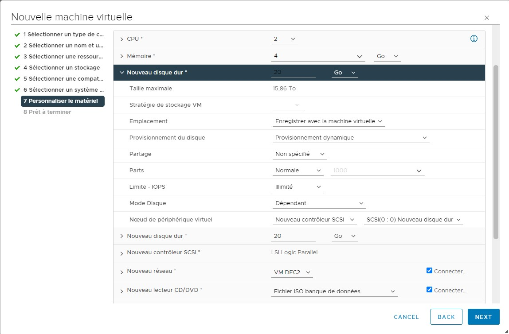

# ISS_TP1_FG_SB
## Création de la machine virtuelle

Si vous créez votre serveur Ubuntu en utilisant vShpere, vous suivrez ces étapes suivantes. La création d’autres machines virtuelles sera semblable, mais pas pareille.

Pour commencer la création, vous trouvez l’endroit où vous souhaitez faire votre serveur, cliquez droit sur le dossier et choisissez « Nouvelle machine virtuelle… ».

La fenêtre de création sera affichée. Pour le premier menu, vous laissez « Créer une machine virtuelle » sélectionné et continuez au prochain menu. Ici, vous nommez votre serveur en respectant les règles de votre entreprise. Pour notre cégep, nous sommes obligés d’utiliser le format « nom de la session_nom de notre cohorte_numéro du cours_nom du système d’expoitation_brève description de la machine_nos initiales_notre matricule », j’ai donc nommé mon serveur « E23_4371_420W45_Ub_TP1_SB_2291653 ». Ici, vous vous assurez que le bon emplacement est bien choisi avant de procéder à la prochaine étape.

Le troisième menu est pour choisir la bonne ressource de calcul et le quatrième est pour choisir le bon stockage. Votre choix dépend de votre entreprise et de votre réseau. Sur le prochain menu, vous sélectionnez une compatibilité. D’habitude, vous choisissez la version la plus récente de ESXi à moins que votre système ait des problèmes avec cette version.

Le sixième menu est important puisque c’est là où vous sélectionnez le système d’exploitation. Étant donné que vous créez un serveur Ubuntu, vous choisissez « Linux » en tant que la famille de système d’exploitation et « Ubuntu Linux (64 bits) » en tant que sa version.

Ensuite, vous personnalisez le matériel de votre serveur. Puisque vous voulez qu’il ait 2 processeurs et 4 Go de mémoire vive, vous vous assurez que vous avez bien défini le nombre de CPU à 2 et la quantité de mémoire à 2 Go. C’est également une bonne pratique de changer le provisionnement des disques durs en dynamique. Vous choisissez aussi le réseau du serveur pour qu’il soit sur le réseau 10.100.2.0/24. Pour moi, cela signifie que je choisis le réseau VM DFC2. Finalement, vous connectez un nouveau lecteur CD/DVD qui est un fichier ISO de la banque de données. Faites attention à bien sélectionner l’ISO d’Ubuntu 22.04 pour les serveurs. Pour moi, ce fichier s’appelle « ubuntu-20.04-live-server-amd64.iso ». Cochez le paramètre « Connecter lors de la mise sous tension », sinon vous ne pourrez pas installer Ubuntu.

Le menu final est un résumé de votre machine, vous vérifiez donc que vous avez tous bien sélectionné avant de terminer la création de votre serveur.

Félicitations, vous avez créé votre serveur et vous pouvez maintenant installer Ubuntu.

## Caractérisation de la machine serveur

- Nom de la machine virtuelle et nom de la machine (hostname)
  - VM : E23_4371_420W45_Ub_TP1_SB_2291653
  - Hostname : srv-web-1234567

- Adresses IPv4, IPv6 avec masque et passerelle
  - IPv4 : 10.100.2.196
  - IPv6 : 
  - Masque : 255.255.255.0
  - Passerelle : 10.100.2.1

- Fichiers hosts

- Port des services ouverts
  - **systemd-n :** 68
  - **systemd-r :** 53
  - **sshd :** 22
  - **mysqld :** 3306, 33060
  - **nginx :** 80
  

- Usager utilisé pour l'installation
  - **Nom d'utilisateur :** ldubois
  - **Mot de passe :** password

## Mises à jour préalables à l'installation et ajout de composants nécessaires.

Avant de commencer l'installation de nouveaux packages, mettez à jour les packages existants en utilisant les commandes suivantes :

`sudo apt update && sudo apt full-upgrade -y`

Ensuite, vous pouvez installer les programmes suivants pour que votre serveur devienne un modèle de déploiement.

- Programmes
  - wget
    - Version : 1.21.2
    - Procédure d'installation : `apt install wget`
    - Répertoires utilisés
      -  Par le programme : /usr/bin/wget
      -  Par ses fichiers de configuration : /etc/wgetrc 
      -  Par ses données : /etc/wgetrc 
    - Espace disque utilisé : 516K
    - Droits sur les répertoires : rwxr-xr-x
    - Nom d'usager (UID) : root
    - Groupe (GID) : root
  - git
    - Version : 2.34.1
    - Procédure d'installation : `apt install git`
    - Répertoires utilisés
      -  Par le programme : /usr/bin/git/
      -  Par ses fichiers de configuration : N/A 
      -  Par ses données : N/A 
    - Espace disque utilisé : 3.6M
    - Droits sur les répertoires : rwxr-xr-x 
    - Nom d'usager (UID) : root
    - Groupe (GID) : root
  - curl
    - Version : 7.81.0
    - Procédure d'installation : `apt install curl`
    - Répertoires utilisés
      -  Par le programme : /usr/bin/curl
      -  Par ses fichiers de configuration : N/A
      -  Par ses données : N/A
    - Espace disque utilisé : 255K
    - Droits sur les répertoires : rwxr-xr-x
    - Nom d'usager (UID) : root
    - Groupe (GID) : root
  - docker
    - Version : 24.0.2
    - Procédure d'installation ([Installation de docker](https://get.docker.com/)) : 
      1. Téléchargez le script 
         - `curl -fsSL https://get.docker.com -o install-docker.sh`
      2. Lancez le script en sudo
         - `sudo sh install-docker.sh`   
    - Répertoires utilisés
      -  Par le programme : /usr/bin/docker
      -  Par ses fichiers de configuration : /etc/docker/
      -  Par ses données : /etc/docker/ 
    - Espace disque utilisé : 4.0K
    - Droits sur les répertoires : rwxr-xr-x
    - Nom d'usager (UID) : root
    - Groupe (GID) : root
  - nginx
    - Version : 1.18.0
    - Procédure d'installation : 
    - Répertoires utilisés
      -  Par le programme : /usr/sbin/nginx 
      -  Par ses fichiers de configuration : /etc/nginx/
      -  Par ses données : /etc/nginx/
    - Espace disque utilisé : 4.0K
    - Droits sur les répertoires : rwxr-xr-x
    - Nom d'usager (UID) : root
    - Groupe (GID) : root
  - mysql server
    - Version : 8.0.33-0
    - Procédure d'installation : `sudo apt install mysql-server-8.0 && sudo mysql_secure_installation`
    - Répertoires utilisés
      -  Par le programme : /usr/bin/mysql 
      -  Par ses fichiers de configuration : /etc/mysql/
      -  Par ses données : /etc/mysql/
    - Espace disque utilisé : 6.7M
    - Droits sur les répertoires : rwxr-xr-x
    - Nom d'usager (UID) : root
    - Groupe (GID) : root

  - php
    - Version : 8.1.2-1
    - Procédure d'installation : `sudo apt install php-fpm php-cli php-mysql php-curl php-json`
    - Répertoires utilisés
      -  Par le programme : /usr/bin/php 
      -  Par ses fichiers de configuration : /etc/8.1/
      -  Par ses données : /etc/php8.1/
    - Espace disque utilisé : 5.3SM
    - Droits sur les répertoires : rwxr-xr-x
    - Nom d'usager (UID) : root
    - Groupe (GID) : root

## Procédure de validation de l'installation

### Vérification de l'installation des logiciels de base
- `wget --version` : vérifie votre installation de wget
- `curl --version` : vérifie votre installation de curl
- `git --version` : vérifie votre installation de git
- `docker version` : vérifie votre installation de docker
- `nginx -v` : vérifie votre installation de nginx
- `mysql --version` : vérifie votre installation de mysql
- `php --version` : vérifie votre installation php

### Vérification du stockage LVM
- `sudo pvs` : vous permet de vérifier l'état de vos physical volumes
- `sudo vgs` : vous permet de vérifier l'état de vos volume groups
- `sudo lvs` : vous permet de vérifier l'état de vos logical volumes

### Vérification de la connexion SSH
Sur votre machine client, tapez la commande `ssh@nom_d_hote_de_votre_serveur -p `

Ensuite, si vous avez configuré votre fichier `~/.ssh/config`, essayez la commande `ssh nom_indique_comme_host` (dans cet exemple, la commande sera `ssh website`)

Les lignes non commentaire de votre fichier sshd_config devrait ressembler à ça : 

Si vous le souhaitez vous pouvez améliorer la sécurité de votre configuration SSH en vérifiant et modifiant au besoin les lignes suivantes (et en les décommentant si nécessaire) :
- `PermitRootLogin no` &rarr; désactive la connexion via l'utilisateur root
- `PermitEmptyPasswords no` &rarr; Empêche des utilisateurs sans mot de passe de se connecter
- `Port 1234` (ou n'importe quel nombre de votre choix autorisé par votre pare-feu) &rarr; Change le port utilisé par SSH
- `ClientAliveInterval 300` &rarr; configure un délai au bout duquel le client inactif sera déconnecté
- `AllowUsers user1 user2` &rarr; limite l'accès SSH uniquement aux utilisateurs listés
- `AllowGroups ssh_group` &rarr; limite l'accès SSH uniquement aux membres du groupe listé

Il existe également d'autres outils de sécurité tels que Fail2Ban et Google Authenticator qui peuvent protéger contre les attaques par force brute et mieux sécuriser les connexions.

En plus, vous pouvez activer les connexions basées sur des clés SSH. Pour ce faire, il faut créer un fichier "authorized_keys" sur le serveur et puis mettre toutes les clés SSH publiques des ordinateurs autorisés dedans. Ensuite, changez `PasswordAuthentication Yes` pour `PasswordAuthentication Yes`, assurez-vous que la ligne `PubkeyAuthentication yes` est activée et que votre fichier "authorized_keys" est identifié dans la ligne `AuthorizedKeysFile`.

Pour que les changements soient pris en compte redémarrez le service en utilisant la commande `systemctl restart ssh.service`
