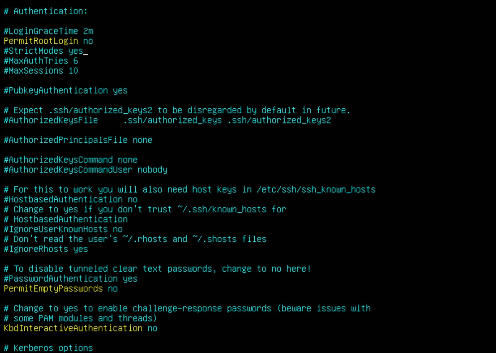

# ISS_TP1_FG_SB
## Caractérisation de la machine serveur

- Nom de la machine virtuelle et nom de la machine (hostname)
  - VM : E23_4371_420W45_Ub_TP1_SB_2291653
  - Hostname : srv-web-1234567

- Adresses IPv4, IPv6 avec masque et passerelle
  - IPv4 : 10.100.2.196
  - IPv6 : 
  - Masque : 255.255.255.0
  - Passerelle : 10.100.2.1

- Fichiers hosts

- Port des services ouverts
  - **systemd-n :** 68
  - **systemd-r :** 53
  - **sshd :** 22
  - **mysqld :** 3306, 33060
  - **nginx :** 80
  

- Usager utilisé pour l'installation
  - **Nom d'utilisateur :** ldubois
  - **Mot de passe :** password

## Mises à jour préalables à l'installation et ajout de composants nécessaires
Ce que doit contenir votre serveur pour devenir un modèle de déploiement.
- Programmes
  - wget
    - Version : 1.21.2
    - Procédure d'installation : `apt install wget`
    - Répertoires utilisés
      -  Par le programme : /etc/wgetrc
      -  Par ses fichiers de configuration : 
      -  Par ses données : 
    - Espace disque utilisé :
    - Droits sur les répertoires :
    - Nom d'usager (UID) :
    - Groupe (GID) :
  - git
    - Version : 2.34.1
    - Procédure d'installation : `apt install git`
    - Répertoires utilisés
      -  Par le programme : 
      -  Par ses fichiers de configuration : 
      -  Par ses données : 
    - Espace disque utilisé :
    - Droits sur les répertoires : 
    - Nom d'usager (UID) :
    - Groupe (GID) :
  - curl
    - Version : 7.81.0
    - Procédure d'installation : `apt install curl`
    - Répertoires utilisés
      -  Par le programme : 
      -  Par ses fichiers de configuration : 
      -  Par ses données : 
    - Espace disque utilisé :
    - Droits sur les répertoires :
    - Nom d'usager (UID) :
    - Groupe (GID) :
  - docker
    - Version : 24.0.2
    - Procédure d'installation ([Installation de docker](https://get.docker.com/)) : 
      1. Téléchargez le script 
         - `curl -fsSL https://get.docker.com -o install-docker.sh`
      2. Lancez le script en sudo
         - `sudo sh install-docker.sh`   
    - Répertoires utilisés
      -  Par le programme : 
      -  Par ses fichiers de configuration : 
      -  Par ses données : 
    - Espace disque utilisé :
    - Droits sur les répertoires :
    - Nom d'usager (UID) :
    - Groupe (GID) :

## Procédure de validation de l'installation

### Vérification de l'installation des logiciels de base
- `wget --version` : vérifie votre installation de wget
- `curl --version` : vérifie votre installation de curl
- `git --version` : vérifie votre installation de git
- `docker version` : vérifie votre installation de docker

### Vérification du stockage LVM
- `sudo pvs` : vous permet de vérifier l'état de vos physical volumes
- `sudo vgs` : vous permet de vérifier l'état de vos volume groups
- `sudo lvs` : vous permet de vérifier l'état de vos logical volumes

### Vérification de la connexion SSH
Sur votre machine client, tapez la commande `ssh@nom_d_hote_de_votre_serveur -p `

Ensuite, si vous avez configuré votre fichier `~/.ssh/config`, essayez la commande `ssh nom_indique_comme_host` (dans cet exemple, la commande sera `ssh website`)

Les lignes non commentaire de votre fichier sshd_config devrait ressembler à ça : 

Si vous le souhaitez vous pouvez améliorer la sécurité de votre configuration SSH en vérifiant et modifiant au besoin les lignes suivantes (et en les décommentant si nécessaire) :
- `PermitRootLogin no` &rarr; désactive la connexion via l'utilisateur root
- `PermitEmptyPasswords no` &rarr; Empêche des utilisateurs sans mot de passe de se connecter
- `Port 1234` (ou n'importe quel nombre de votre choix autorisé par votre pare-feu) &rarr; Change le port utilisé par SSH
- `ClientAliveInterval 300` &rarr; configure un délai au bout duquel le client inactif sera déconnecté
- `AllowUsers user1 user2` &rarr; limite l'accès SSH uniquement aux utilisateurs listés
- `AllowGroups ssh_group` &rarr; limite l'accès SSH uniquement aux membres du groupe listé

Pour que les changements soient pris en compte redémarrez le service en utilisant la commande `systemctl restart ssh.service`